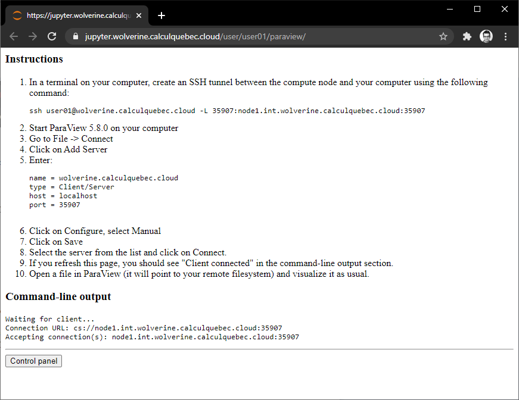

# ParaView Server Web Proxy

This package starts an instance of ParaView Server in background and a Tornado webserver.
The webserver serves a page that contains dynamically generated instructions on how 
to connect to the ParaView Server and output of the ParaView Server command-line.

This package is generally used in conjunction with [jupyter-server-proxy](https://github.com/jupyterhub/jupyter-server-proxy).

## Setup

```
pip install git+https://github.com/cmd-ntrf/pvserver-webproxy.git
```

## Usage

### Standalone
```
python -m pvserver-webproxy 8888
```

### jupyter-server-proxy

Add the following to `jupyter_notebook_config.json`:
```
{
  "ServerProxy": {
    "servers": {
      "paraview": {
        "command": [
          "python",
          "-m",
          "pvserver-webproxy",
          "{port}"
        ],
        "timeout": 60,
        "launcher_entry": {
          "title": "ParaView Server",
        }
      }
    }
  }
}
```

## Screenshot

